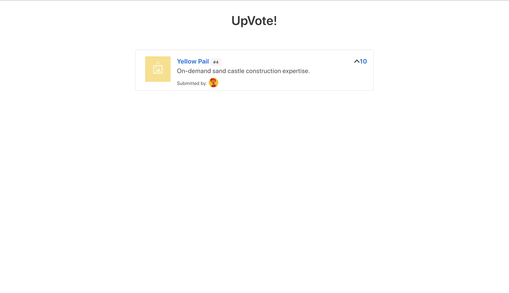
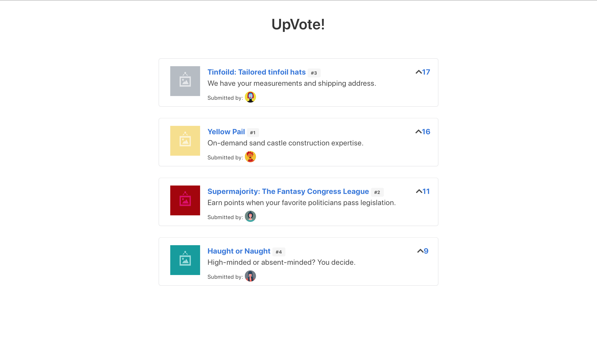

# VUE UPVOTE
This is my first application using vue. This app also uses HTML, CSS, Bulma and Awesome.io (reference links can be found at the bottom) and was created by following along <em> Fullstack Vue </em> by Hassan Djirdeh, Nate Murray, and Ari Lerner.

### Folder and File Explanations
The app folder contains three files: 
- index.html
- main.js
- seed.js

Main.js contains all the Vue JavaScript used, and seed.js contains the object array that *seeds* all the data to be pulled.

Public contains all the css/stylesheets as well as any and all of the images

#### Static

#### Reactive (*Dynamically Data Driven*)

#### Sorted by Computed properties (points)

#### Final Output with stock images

<a href="http://bulma.io/documentation" >Bulma Documentation</a>  
<a href="http://fontawesome.io/" >Font Awesome</a>
